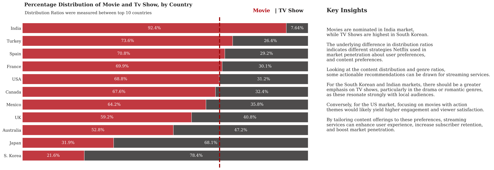

# 21 Years of Netflix - Data Insights on Global Content Distribution and Demographics

_This project is a part of Bootcamp project competitions derived from the Netflix movies and TV shows dataset sourced from Kaggle [Netflix Dataset](https://www.kaggle.com/code/ridwanadejumo/basic-data-visualization-on-the-netflix-dataset)._
<br>

# 1. Introduction

"Companies rarely die from moving too fast, and they frequently die from moving too slowly." - Reed Hastings Netflix co-founder and then CEO said when the company went all on in streaming service. For a streaming service, Netflix is a data-focused company, using data-informed decision making to improve their service such as Netflix's personalization algorithm can make recommendations to each user. 

But how do they create a good set of content (movies or tv series) to choose from? What data would you like to have if you were designing an asset suite?

In this project, I take two approaches:
- The bottom-up approach, where I let the data naturally surface on distribution, content trends over the years, and genre preferences (Explorative Data Analysis).
  
Explorative Data Analysis on Netflix Global Content Distribution and Demographics

<br>

# ✨ 2. Explorative Data Analysis 

## 2.1 Report Objectives
<br>

**7770 is the amout of movies and tv series**  Netflix has produced up until 2021. With the extensive library of films and television series, including original productions, Netflix has built a reputation as a content powerhouse, attracting subscribers with its unique offerings. 

Inspired by Netflix, the objectives of this project is to understand the dynamics of Netflix content landscape through the exporative data analysis and advanced visualization leveraging Python programming along with libraries such as NumPy, Pandas, Matplotlib, and Seaborn.

## 2.2 Analysis Techniques
  - 💡 Use MultiLabelBinarizer from sklearn Ml algorithm to tranform `listed_in` into binary variable `genre`.
  - 📈 Calculate correlation coefficient and visualize Netflix's genres in Movie and TV series.
  - 🖥️ Use Netflix's website on rating content, I create `age` column from the original `rating` data.
  - 📊 Communicate the insights with visualization, title, subtitiles and personal analysis with Python programming (Matplotlib, Seaborn liberies) advanced techniques.

<br>

## 3.3 Dataset Introduction

[The Netflix dataset Information](https://github.com/NguyenDangXuanLinh/Netflix-Data-Analysis/blob/main/Dataset_Information.md)


## 3.4 Key Insights
```ruby
    x=df.groupby(['type'])['type'].count()
    y=len(df)
    r=((x/y)).round(2)
    mf_ratio = pd.DataFrame(r).T
   ```

    
```ruby
data_q2q3 = df[['type', 'first_country']].groupby('first_country')['type'].value_counts().unstack().loc[country_order]
data_q2q3['sum'] = data_q2q3.sum(axis=1)
data_q2q3_ratio = (data_q2q3.T / data_q2q3['sum']).T[['Movie', 'TV Show']].sort_values(by='Movie',ascending=False)[::-1]
```    

    
```ruby
data_sub = df.groupby('type')['year_added'].value_counts().unstack().fillna(0).loc[['TV Show','Movie']].cumsum(axis=0).T
```    

```ruby
order = pd.DataFrame(df.groupby('rating')['count'].sum().sort_values(ascending=False).reset_index())
rating_order = list(order['rating'])
```

    
```ruby
df['month_name_added'] = pd.Categorical(df['month_name_added'], categories=month_order, ordered=True)
data_sub = df.groupby('type')['month_name_added'].value_counts().unstack().fillna(0).loc[['TV Show','Movie']].cumsum(axis=0).T
```


```ruby
df['first_country'] = df['country'].apply(lambda x: x.split(",")[0])
df['target_ages'] = df['rating'].replace(ratings_ages)
df['target_ages'].unique()
df['genre'] = df['listed_in'].apply(lambda x :  x.replace(' ,',',').replace(', ',',').split(','))

data = df.groupby('first_country')['count'].sum().sort_values(ascending=False)[:10]
```


```ruby
df['genre'] = df['listed_in'].apply(lambda x :  x.replace(' ,',',').replace(', ',',').split(','))
Types = []
    for i in df['genre']: Types += i
test = df['genre']
mlb = MultiLabelBinarizer()
res = pd.DataFrame(mlb.fit_transform(test), columns=mlb.classes_, index=test.index)
corr = res.corr()

df_tv = df[df["type"] == "TV Show"]
```

 ```ruby
df_tv = df[df["type"] == "Movie"]
``` 


```ruby
data = df.groupby('first_country')[['count']].sum().sort_values(by='count',ascending=False).reset_index()
data = data['first_country']

df_heatmap = df.loc[df['first_country'].isin(data)]
df_heatmap = pd.crosstab(df_heatmap['first_country'],df_heatmap['target_ages'],normalize = "index").T
country_order2 = ['USA', 'India', 'UK', 'Canada', 'Japan', 'France', 'S. Korea', 'Spain',
       'Mexico', 'Turkey']

age_order = ['Kids','Older Kids','Teens','Adults']
age_heatmap_df = df_heatmap.loc[age_order,country_order2]
```    


